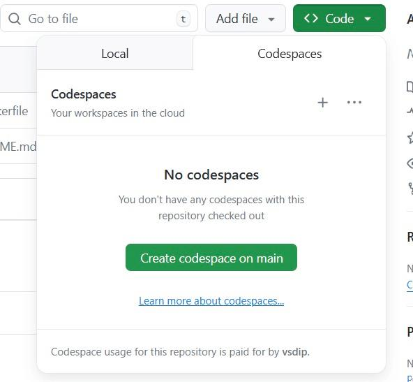
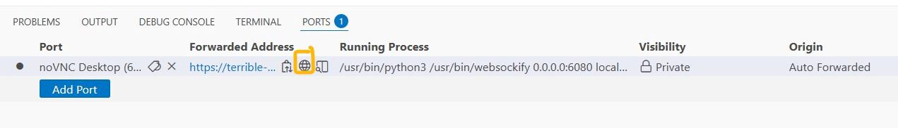
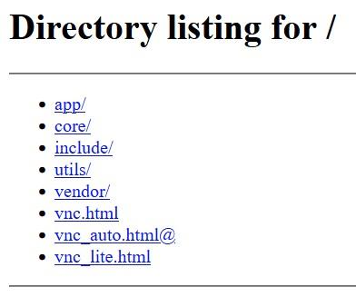
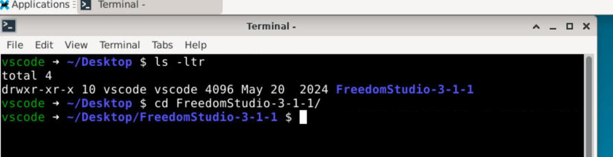
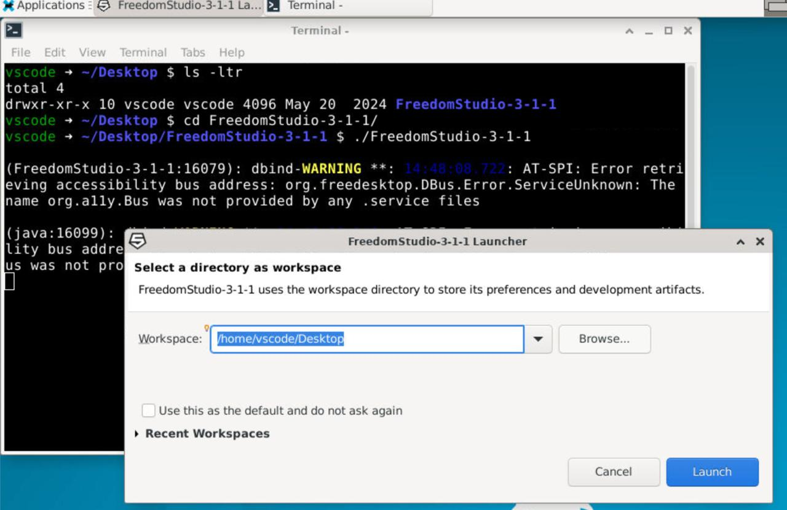
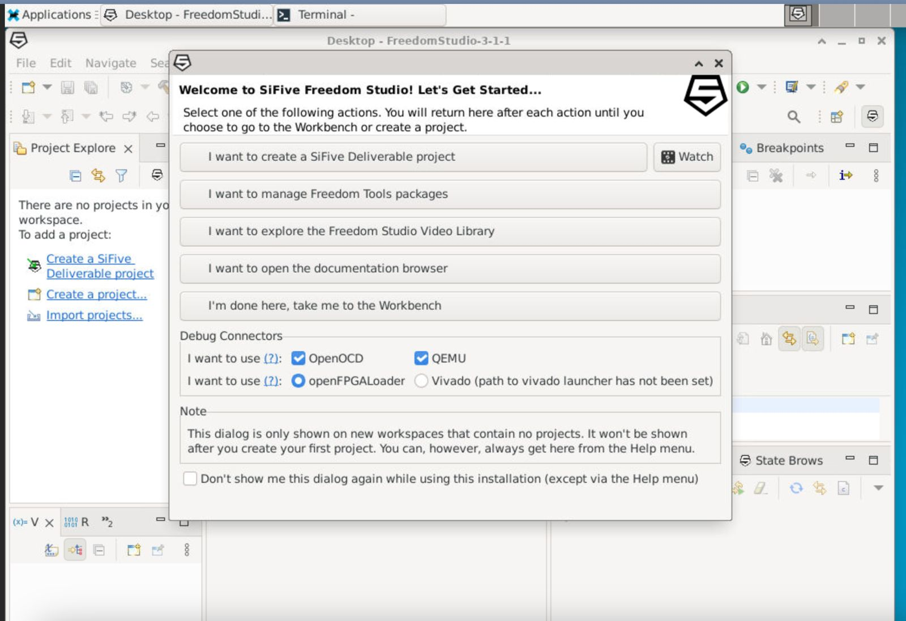

# VSD RISC-V Edge-AI Workshop — SiFive FreedomStudio on GitHub Codespaces

This repository provides a complete cloud-based environment for the **RISC-V Edge-AI Workshop** using **SiFive FreedomStudio 3.1.1**.
Participants can compile, debug, and explore RISC-V applications directly from their browsers using GitHub Codespaces.
No local installation or hardware setup is required.

---

## 1. Launch Codespace

1. Go to the repository:
   [https://github.com/vsdip/vsd-riscv-edgeai](https://github.com/vsdip/vsd-riscv-edgeai)
2. Click the green **Code ▼** button and open the **Codespaces** tab.
3. Select **Create codespace on main**.
   

GitHub will automatically start a new Codespace workspace configured for FreedomStudio.

---

## 2. Access the noVNC Desktop

1. Once the Codespace has launched, go to the **PORTS** tab next to the terminal.
   
2. Wait until **Port 6080** (labeled *noVNC Desktop*) appears.
   Then click the **globe icon** under “Forwarded Address.”
   
3. A new browser tab will open showing a directory listing.
   Click **vnc.html** to launch the full graphical desktop.
   

---

## 3. Start SiFive FreedomStudio

1. Inside the noVNC desktop, open a terminal window (Applications → Terminal).

2. Check that FreedomStudio is available on the Desktop and launch it:

   ```bash
   cd ~/Desktop/FreedomStudio-3-1-1
   ./FreedomStudio-3-1-1
   ```

   

3. When prompted for a workspace, use the default:

   ```
   /home/vscode/Desktop
   ```

   Then click **Launch**.
   

---

## 4. FreedomStudio Setup Wizard

After startup, FreedomStudio will display the **Welcome to SiFive Freedom Studio** dialog.
You can explore available tools and debuggers such as **OpenOCD**, **QEMU**, or **openFPGALoader**, then select
**“I’m done here, take me to the Workbench.”**



This opens the main Eclipse-based IDE interface for RISC-V software development.

---

## 5. Explore and Build RISC-V Projects

Inside the IDE:

1. Go to **Sifive Tools -> Create Software Example Project -> Create a new Validation Project**.
2. Select any example RISC-V or Edge-AI project folder.
3. Build using the hammer icon or by pressing `Ctrl+B`.
4. Run and debug using **QEMU** for software-level testing.

---

## 6. Environment Details

* Operating System: Ubuntu 22.04
* Desktop Environment: XFCE (served via noVNC)
* IDE: SiFive FreedomStudio 3.1.1
* Access Port: 6080 (auto-forwarded by GitHub Codespaces)
* FreedomStudio is downloaded and extracted automatically during setup (`.devcontainer/setup.sh`)

If FreedomStudio does not appear after Codespace creation, you can re-run manually:

```bash
cd ~/Desktop/FreedomStudio-3-1-1
./FreedomStudio-3-1-1
```

---

## 7. Tips for Smooth Operation

* Use a Chromium-based browser (Chrome or Edge) for better VNC responsiveness.
* Avoid closing the Codespace tab while FreedomStudio is running.
* All files in `/home/vscode/Desktop` persist while the Codespace is active.
* If the desktop view appears blank, refresh the noVNC tab once after the Codespace boots.

---

## 8. Troubleshooting

| Issue                                | Solution                                                            |
| ------------------------------------ | ------------------------------------------------------------------- |
| Port 6080 does not appear            | Wait for setup to complete (~2–3 min). Refresh PORTS tab.           |
| noVNC window is blank                | Refresh browser tab or reopen from PORTS list.                      |
| FreedomStudio not found              | Run setup manually or restart Codespace.                            |
| Workspace prompt reappears each time | Select "Use this as default and do not ask again" before launching. |

---

### Maintained by

**VLSI System Design (VSD)**
[https://www.vlsisystemdesign.com](https://www.vlsisystemdesign.com)

